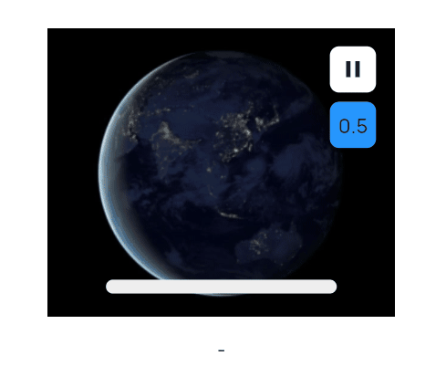

# Custom Widgets / CustomVideoPlayer

A customizable video player foundation for FlutterFlow.

Unlike the standard FlutterFlow video widget, this custom widget is designed to support:

- custom progress bars
- custom play/pause buttons
- custom autoplay behavior
- custom buffering UI
- custom completed callbacks
- external playback control
- custom seek behavior

Compatible with FlutterFlow Custom Widgets.

Useful for:

- TikTok / Reels style feeds
- autoplay videos
- custom media experiences
- custom overlays and controls
- synchronized playback systems
- externally controlled video playback

## Demo



## Features

- External play/pause control
- Seek support
- Progress callback
- Buffering callback
- Finished callback
- Mute support
- Optional overlay UI
- Error handling
- Throttled progress updates
- Customizable video UI architecture

## FlutterFlow Widget Parameters

| Name                     | Type                    | Description                                  |
| ------------------------ | ----------------------- | -------------------------------------------- |
| width                    | double?                 | Widget width                                 |
| height                   | double?                 | Widget height                                |
| url                      | String                  | Video URL                                    |
| cbProgress               | Action                  | Progress callback                            |
| cbFinished               | Action                  | Called when video finishes                   |
| cbBuffering              | Action                  | Called when buffering state changes          |
| shouldPlay               | bool?                   | External play/pause control                  |
| seekTo                   | double?                 | Seek position (`0.0 - 1.0`)                  |
| muted                    | bool                    | Mute/unmute video                            |
| showOverlay              | bool                    | Show built-in overlay UI                     |
| progressUpdateIntervalMs | int                     | Progress callback throttle interval in ms    |

## cbProgress Callback Parameters

| Name     | Type    | Description               |
| -------- | ------- | ------------------------- |
| progress | double? | Current progress (`0-1`)  |

## cbBuffering Callback Parameters

| Name         | Type  | Description              |
| ------------ | ----- | ------------------------ |
| isBuffering  | bool  | Current buffering state  |

## Example Behaviors

- Custom progress bar
- Custom play/pause button
- Seek to custom positions
- Replay video externally
- Autoplay next video
- Trigger analytics when completed
- Create feed-style video systems

## FlutterFlow Free Tier Note

If Custom Dependencies is unavailable:

1. Add FlutterFlow's built-in VideoPlayer widget once
2. FlutterFlow automatically includes the `video_player` package
3. You can then use `CustomVideoPlayer`

## Full Widget

```dart
// Automatic FlutterFlow imports
import '/backend/schema/structs/index.dart';
import '/flutter_flow/flutter_flow_theme.dart';
import '/flutter_flow/flutter_flow_util.dart';
import '/custom_code/widgets/index.dart'; // Imports other custom widgets
import '/custom_code/actions/index.dart'; // Imports custom actions
import '/flutter_flow/custom_functions.dart'; // Imports custom functions
import 'package:flutter/material.dart';

// Begin custom widget code
// DO NOT REMOVE OR MODIFY THE CODE ABOVE!

import 'package:video_player/video_player.dart';

class CustomVideoPlayer extends StatefulWidget {
  const CustomVideoPlayer({
    super.key,
    this.width,
    this.height,
    required this.url,
    this.cbProgress,
    this.cbFinished,
    this.cbBuffering,
    this.shouldPlay,
    this.seekTo,
    required this.muted,
    required this.showOverlay,
    required this.progressUpdateIntervalMs,
  });

  final double? width;
  final double? height;
  final String url;

  /// progress: 0.0 – 1.0
  final Future Function(double? progress)? cbProgress;

  /// called once when video finishes
  final Future Function()? cbFinished;

  /// called when buffering state changes
  final Future Function(bool isBuffering)? cbBuffering;

  /// external play / pause control
  final bool? shouldPlay;

  /// seek position: 0.0 – 1.0
  final double? seekTo;

  /// mute / unmute
  final bool muted;

  /// show built-in overlay
  final bool showOverlay;

  /// throttle progress callback updates
  final int progressUpdateIntervalMs;

  @override
  State<CustomVideoPlayer> createState() => _CustomVideoPlayerState();
}

class _CustomVideoPlayerState extends State<CustomVideoPlayer> {
  late VideoPlayerController _controller;

  bool _isInitialized = false;
  bool _hasFinished = false;
  bool _hasError = false;

  bool _lastBufferingState = false;

  DateTime? _lastProgressCallbackTime;

  @override
  void initState() {
    super.initState();
    _initVideo();
  }

  Future<void> _initVideo() async {
    try {
      _controller = VideoPlayerController.networkUrl(
        Uri.parse(widget.url),
      )..addListener(_onVideoUpdate);

      await _controller.initialize();

      await _controller.setVolume(widget.muted ? 0 : 1);

      if (!mounted) return;

      setState(() {
        _isInitialized = true;
        _hasError = false;
      });

      if (widget.shouldPlay ?? false) {
        _controller.play();
      }
    } catch (e) {
      if (!mounted) return;

      setState(() {
        _hasError = true;
      });
    }
  }

  void _onVideoUpdate() {
    if (!_controller.value.isInitialized) return;

    final value = _controller.value;

    final durationMs = value.duration.inMilliseconds;
    final positionMs = value.position.inMilliseconds;

    // BUFFERING CALLBACK
    if (widget.cbBuffering != null &&
        value.isBuffering != _lastBufferingState) {
      _lastBufferingState = value.isBuffering;
      widget.cbBuffering!(value.isBuffering);
    }

    // THROTTLED PROGRESS CALLBACK
    if (durationMs > 0 && widget.cbProgress != null) {
      final now = DateTime.now();

      if (_lastProgressCallbackTime == null ||
          now.difference(_lastProgressCallbackTime!).inMilliseconds >=
              widget.progressUpdateIntervalMs) {
        _lastProgressCallbackTime = now;

        final progress = (positionMs / durationMs).clamp(0.0, 1.0);

        widget.cbProgress!(progress);
      }
    }

    // FINISHED CALLBACK
    if (!_hasFinished &&
        durationMs > 0 &&
        positionMs >= durationMs) {
      _hasFinished = true;

      if (widget.cbFinished != null) {
        widget.cbFinished!();
      }
    }
  }

  @override
  void didUpdateWidget(covariant CustomVideoPlayer oldWidget) {
    super.didUpdateWidget(oldWidget);

    // URL CHANGED
    if (oldWidget.url != widget.url) {
      _controller.removeListener(_onVideoUpdate);
      _controller.dispose();

      _isInitialized = false;
      _hasFinished = false;
      _hasError = false;

      _initVideo();
      return;
    }

    if (!_isInitialized) return;

    // PLAY / PAUSE CONTROL
    final shouldPlay = widget.shouldPlay ?? false;
    final isPlaying = _controller.value.isPlaying;

    if (shouldPlay != isPlaying) {
      shouldPlay ? _controller.play() : _controller.pause();
    }

    // MUTE CONTROL
    if (oldWidget.muted != widget.muted) {
      _controller.setVolume(widget.muted ? 0 : 1);
    }

    // SEEK CONTROL
    if (widget.seekTo != null &&
        widget.seekTo != oldWidget.seekTo) {
      final duration = _controller.value.duration;

      final seekPosition = Duration(
        milliseconds:
            (duration.inMilliseconds * widget.seekTo!)
                .round(),
      );

      _controller.seekTo(seekPosition);

      _hasFinished = false;
    }
  }

  @override
  void dispose() {
    _controller.removeListener(_onVideoUpdate);
    _controller.dispose();
    super.dispose();
  }

  void _togglePlayPause() {
    if (!_isInitialized) return;

    _controller.value.isPlaying
        ? _controller.pause()
        : _controller.play();

    setState(() {});
  }

  @override
  Widget build(BuildContext context) {
    // ERROR UI
    if (_hasError) {
      return Container(
        width: widget.width ?? double.infinity,
        height: widget.height ?? 200,
        color: Colors.black12,
        alignment: Alignment.center,
        child: const Text(
          'Failed to load video',
          style: TextStyle(color: Colors.black54),
        ),
      );
    }

    // LOADING UI
    if (!_isInitialized) {
      return SizedBox(
        width: widget.width ?? double.infinity,
        height: widget.height ?? 200,
        child: const Center(
          child: CircularProgressIndicator(),
        ),
      );
    }

    final videoSize = _controller.value.size;

    return SizedBox(
      width: widget.width ?? double.infinity,
      height: widget.height ?? 200,
      child: ClipRect(
        child: FittedBox(
          fit: BoxFit.cover,
          child: SizedBox(
            width: videoSize.width,
            height: videoSize.height,
            child: Stack(
              alignment: Alignment.center,
              children: [
                VideoPlayer(_controller),

                // BUILT-IN OVERLAY
                if (widget.showOverlay)
                  Positioned.fill(
                    child: GestureDetector(
                      onTap: _togglePlayPause,
                      child: AnimatedOpacity(
                        opacity:
                            _controller.value.isPlaying
                                ? 0.0
                                : 0.7,
                        duration:
                            const Duration(milliseconds: 200),
                        child: Container(
                          color: Colors.black45,
                          child: const Icon(
                            Icons.play_arrow,
                            size: 64,
                            color: Colors.white,
                          ),
                        ),
                      ),
                    ),
                  ),

                // BUFFERING UI
                if (_controller.value.isBuffering)
                  const Center(
                    child: CircularProgressIndicator(),
                  ),
              ],
            ),
          ),
        ),
      ),
    );
  }
}
```

## Example Use Cases

- Build custom video controls in FlutterFlow
- Create TikTok/Reels style feeds
- Trigger autoplay logic
- Build synchronized progress bars
- Create custom buffering overlays
- Detect completed playback events
- Build fully custom video experiences