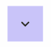

# ExpandableChevron

A reusable chevron toggle pattern with rotation animation for expand/collapse interactions in FlutterFlow.

---

## Demo

Expected output:



---

## Problem

In FlutterFlow, toggle chevrons are commonly implemented using two separate icons:

- one icon for expanded state
- one icon for collapsed state

The displayed icon changes based on state conditions.

While this works functionally, the transition is instant and does not provide a smooth animation effect between states.

---

## Solution

This pattern solves the issue by using:

- a single image
- rotation animation
- state-driven behavior

Instead of swapping between two different icons, the same chevron image is rotated using animation.

### Initial Render Behavior

On the first render, the chevron rotation technically uses animation, but the animation duration is set to `0`.

This makes the initial state appear instantly without visible animation, preventing unwanted motion during component initialization.

After initialization, the animation duration is updated to the configured value.

### Toggle Behavior

Once initialized, every state change triggers a smooth rotation animation between expanded and collapsed states.

### State Management

The expanded/collapsed state is managed outside the component through page or parent state.

This allows the chevron state to stay synchronized with other UI components and application logic in FlutterFlow.

---

## Component Parameters

| Parameter           | Type    | Default | Description                                                     |
| ------------------- | ------- | ------- | --------------------------------------------------------------- |
| `isExpanded`        | Boolean | `false` | Controls whether the chevron is in expanded or collapsed state. |
| `onTap`             | Action  | -       | Callback executed when the component is tapped.                 |
| `width`             | Double  | `50`    | Width of the tappable container.                                |
| `height`            | Double  | `50`    | Height of the tappable container.                               |
| `animationDuration` | Integer | `300`   | Rotation animation duration in milliseconds.                    |

---

## Component State

| State      | Type    | Default |
| ---------- | ------- | ------- |
| `duration` | Integer | `0`     |

---

## Component Structure

```text
Container
└── Stack
    └── Image (Centered)
```

---

## Animation

### Target

`Image`

### Trigger

`On Action Trigger`

### Animation Type

`Rotate`

### Configuration

#### Duration

```text
duration
```

#### Initial Turns

```text
if isExpanded:
    0
else:
    -0.5
```

#### End Turns

```text
if isExpanded:
    -0.5
else:
    0
```

---

## Actions

### On Page Load

1. Trigger widget animation:

   ```text
   Chevron
   ```

2. Update component state:

   ```text
   duration = animationDuration
   ```

---

### On Tap — Container

1. Execute callback:

   ```text
   onTap
   ```

2. Update component state:

   ```text
   duration = animationDuration
   ```

---

## Sample Usage

### Sample Page State

| State        | Type    | Default |
| ------------ | ------- | ------- |
| `isExpanded` | Boolean | `false` |

---

### ExpandableChevron Parameters

| Parameter           | Value               |
| ------------------- | ------------------- |
| `isExpanded`        | `isExpanded`        |
| `onTap`             | Toggle `isExpanded` |
| `width`             | Default (`50`)      |
| `height`            | Default (`50`)      |
| `animationDuration` | Default (`300`)     |

---

### Example Flow

1. Initial page state:

   ```text
   isExpanded = false
   ```

2. User taps `ExpandableChevron`

3. `onTap` toggles page state:

   ```text
   isExpanded = !isExpanded
   ```

4. Chevron rotates based on updated `isExpanded` value
